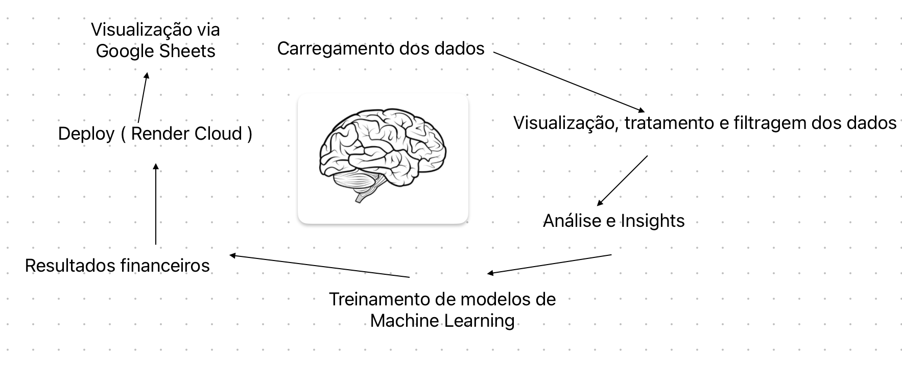
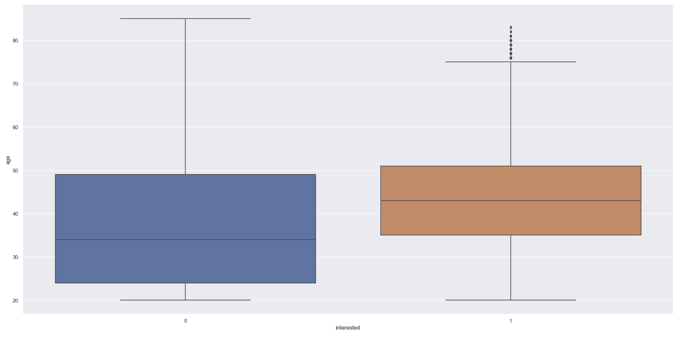
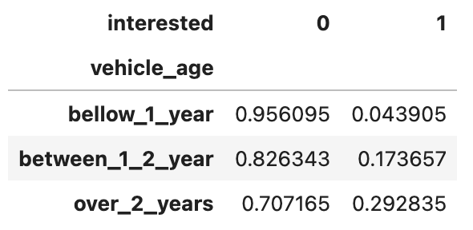
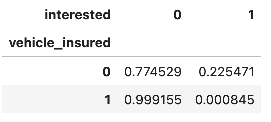
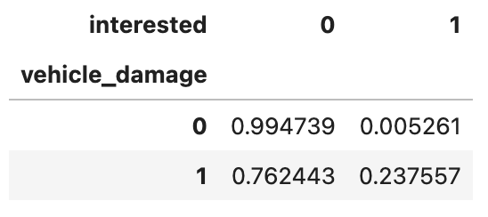
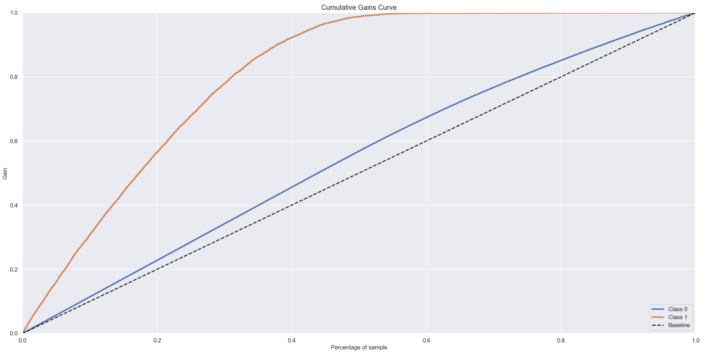
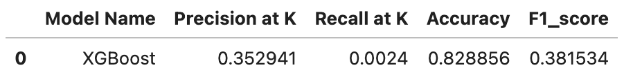
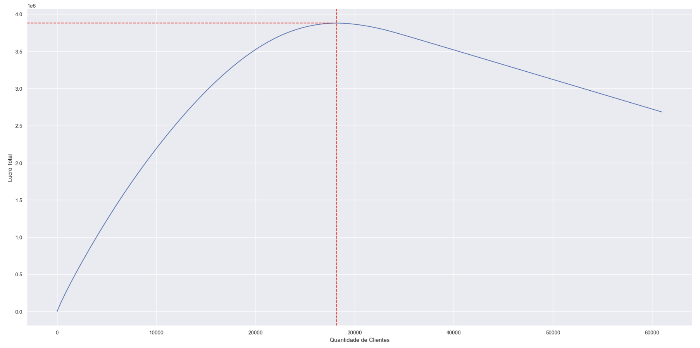
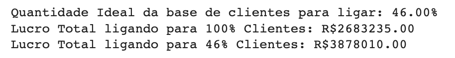
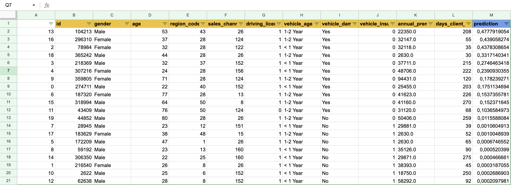

# Insurance Cross Sell Project 🚙

# 1.0 Business Problem
    
Health Insurance is a fictitious company that has been offering health insurance services to its customers for over 10 years across the world. Seeking to expand its spectrum of activity, the company now wishes to offer its customer base vehicle insurance.

To this end, a survey was carried out with approximately 304 thousand customers in order to understand which ones were interested or not in purchasing the new insurance. This data was then stored in a database and now the company has a base of 76 thousand new customers to whom it wants to offer the new insurance.
  
The plan is to allocate part of the sales team to contact these customers via **telephone** offering insurance. Given the number of salespeople and the budget allocated to the project, the team has the capacity to make up to 20 thousand calls to the potential customer base.

With this project restriction, Health Insurance would like to reach as many people interested in insurance as possible within the limit of possible calls.
  
To do this, it hired a team of data scientists so that they could select the best customers from the potential base for offering insurance and and store the customer data in a table in Google Sheets.

# 2.0 Business Assumptions

- The sales team already uses Google Sheets as a corporate tool. The purchasing propensity ranking needs to be incorporated into it.

## 2.1 Data Description

| Store              | Sales      
| ------------------ | ---------- 
|id	                 | Unique identifier for each customer
|Gender | Customer gender
|Driving_License | 0 : Customer does not have a driver's license, 1 : Customer has a driver's license
|Region_Code | Unique region identifier
|Vehicle_Insured | 1 : Customer already has vehicle insurance, 0 : Customer does not have vehicle insurance
|Vehicle_Age | Vehicle age
|Vehicle_Damage | 1: Customer has had his car damaged before. 0: Customer has never had their car damaged
|Annual_Premium | Amount to be paid annually to take out the insurance
|Sales_Channel | Identifier of the channel in which the research was carried out (email, telephone, etc.)
|Days_Client_Associate | Total number of days that the customer is associated with the company
|Interested | 1 : Customer is interested in vehicle insurance, 0 : Customer is not interested

# 3.0 Solution Strategy

The strategy uses the CRISP-DS method, which consists of 9 cyclical steps, where at each iteration of the nine steps, the business result is being improved, aiming for increasingly faster deliveries and increasingly more quality and accuracy, thus enabling the teams that will use the developed results have a product that is minimally usable in the first delivery and that is perfected over time.

This process can be illustrated by the following image:

# 4.0 Some Insights

An exploratory analysis of the data was carried out in order to understand some of its behaviors and distributions. In this process, some insights were generated, the 3 main ones were:

## 1) Older people tend to be more interested in purchasing car insurance.

- **True** 

## 2) People with new vehicles (< 1 year old) tend not to be interested in purchasing car insurance.

- **True** 

## 3) It is possible to say that people who already have insurance are not interested in purchasing car insurance.

- **True** 

## 4) It is possible to say that people who have never had their car damaged are not interested in purchasing car insurance.

- **True** 

# 5.0 Machine Learning

To define the best model to be used, 5 different classification models were tested. These were evaluated mainly by ranking metrics (a key point in this project) but also by the ranking metrics themselves.

The main metrics observed were:

- Cumulative Gain Curve 
- Precision at K

The Classification metrics were also observed:

- Accuracy
- Precision
- Recall
- F1 Score

To evaluate the metrics of all tested models in a more reliable way, the Cross Validation technique was used.

In this process, the model is trained and validated with different segments of the available dataset in order to reduce any bias that may occur during the separation of data for training.
  
The ranking metrics for all tested models are shown below:

- Without Cross Validation:

| Model                | Precision at K      | Recall at K           | Accuracy              | F1_score                | 
| -------------------- | ------------------- | --------------------  | --------------------  | ----------------------   |                 
| KNN                  | 0.411765                | 0.002800              | 0.770885              | 0.236982                |
| Random Forest        | 0.274510                | 0.001867              | 0.784070              | 0.414582                |
| Extra Trees          | 0.392157                | 0.002667              | 0.837728              | 0.328652                |
| XGBoost              | 0.450980                | 0.003067              | 0.865673              | 0.427248                |

- With Cross Validation:

| Model                | Precision at K      | Recall at K           | Accuracy              | F1_score                | 
| -------------------- | ------------------- | --------------------  | --------------------  | ----------------------   |                 
| KNN                  | 1.0                | 0.0              | 0.855              | 0.861                   |
| Random Forest        | 1.0                | 0.0              | 0.883              | 0.889                   |
| Extra Trees          | 1.0                | 0.0              | 0.908              | 0.907                   |
| XGBoost              | 1.0                | 0.0              | 0.92               | 0.915                   |

But the main metric for this project is called Cumulative Gain Curve. Using XGBoost Classifier, with approximately 50% of our dataset sorted by Propensity Score, we got all the customers that was really interested in insurance. 

The image shows this:

Based on these metrics, the model chosen for this project was **XGBoost Classifier**.

The adjustment of the hyperparameters of the chosen model was carried out using the Bayesian Optimazation method.

In short, given an objective function (which in this work was the maximization of the model's accuracy) this method seeks the **global optimum** by approximating the real function of hyperparameters through a “false” function called a substitute function.

The advantage of this method is that it uses the results of previous iterations to decide future steps, changing or maintaining the strategy depending on the variation of the objective function at each iteration. A little more about this method can be found at [link](https://medium.com/analytics-vidhya/hyperparameter-search-bayesian-optimization-14be6fbb0e09).

For this application, the optuna library was used. The results of the method iterations until its convergence are shown below:

# 6.0 Business Results

From the predictions made by the model, we can draw some conclusions.

Assuming that for each customer the company can sell vehicle insurance to, it has a Gross Profit of $540. Let's also consider that the company intends to call these potential customers, and each call has a total cost of $40.

Looking at the graph below, the initial customers are those with the highest probability of accepting vehicle insurance. However, there comes a point where the company starts calling customers who do not have a very high chance of purchasing insurance, and the cost starts to stand out, reducing the profit.

In other words, the company needs to call 46% of the customer base (those with the highest probability of accepting insurance) to maximize profit.

- Total Profit calling 100% Customers: R$2,683,235.00
  
- Total Profit calling 46% Customers: R$3,878,010.00

This is a profit 1.44 times higher using the model.

Infos:

# 7.0 Deployment in Render Cloud

For the business and sales team to access the model results, an API was built that returns the probability value ( propensity score ) of conversion of the customer of interest.

Basically, based on the customer data provided by the user or application, the [Handler](https://github.com/luishmq/insurance_cross_sell/blob/main/handler.py) file loads the necessary transformations to the data and the already trained model. Then, the prediction is made and this value is returned to the user.

In order to facilitate the sales and business team's access to data, a [spreadsheet on Google Sheets](https://docs.google.com/spreadsheets/d/1wK0s_nfN0GdiEQOLKqZC0hthkC7nBdX-OX0s0r40mcw/edit#gid=0) was created that performs Predicting desired customers in a very simple way:

1. The data from the new customer base is inserted into the Google Sheets spreadsheet by the user
2. A button was created in the top menu called “Health Insurance Prediction” which, when clicked, generates the score of all customers entered in the spreadsheet
3. With the scores of all customers, the team will be able to start its operation

The following image show this spreadsheet:

# 8.0 Conclusions

As we can see, the final product was a Google Sheets spreadsheet that predicts and ranks customers who are most likely to acquire vehicle insurance, allowing the insurance company to contact only potential customers. This spreadsheet can be accessed from any device with internet access that has the Google Sheets application.

# 9.0 Lessons Learned

- Learn to rank techniques
- Develop solutions in a cyclical way, thus delivering results in a more agile and efficient way
- Google Sheets for score analysis easily via API
- Optuna 

# 10.0 Next Steps

As next steps and improvements for the evolution of this project, the following points were listed:

- Testing other Machine Learning models / Fine-tuning parameters to further refine the model
- Creation of new features based on existing features, which help in modeling the phenomenon
- Optimizing the model to make predictions and rank customers in Excel
